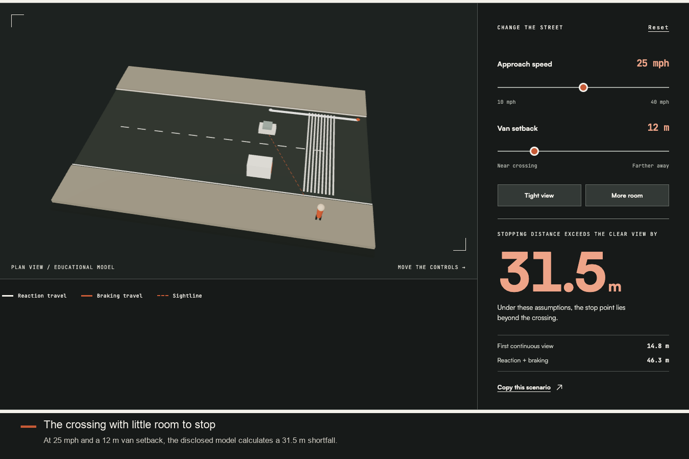
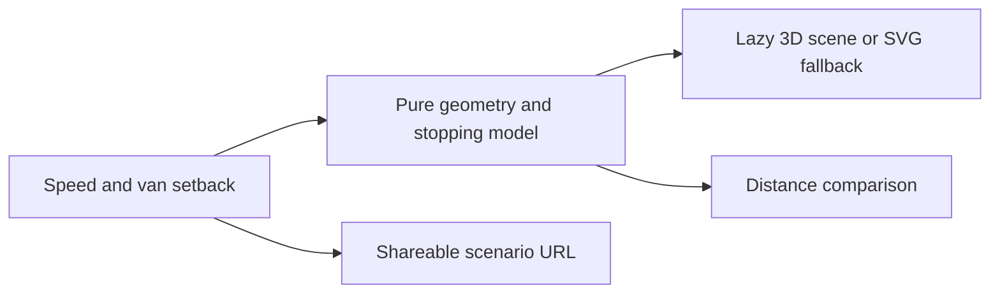

# Sightline

**See what a parked vehicle hides at a school crossing.** Built by **Rishik Rontala** for [Next Byte Hacks: V4](https://next-byte-hacks-v4.devpost.com/).



[Try Sightline](https://rishikrrontala-bot.github.io/next-byte-hacks-v4/) · [Watch the demo](https://rishikrrontala-bot.github.io/next-byte-hacks-v4/demo.html) · [Download the video](submission/video/demo.mp4) · [Model limitations](docs/LIMITATIONS.md)

## The problem and the experiment

A marked crossing can still hide a waiting pedestrian behind a parked vehicle. Sightline makes the relationship between available view and stopping distance visible. Move the van or change approach speed; the 3D scene, measured trace, and distance comparison update together.

The default case—25 mph and 12 m of setback—has **14.8 m of continuous view** and **46.3 m of calculated stopping distance**, leaving a **31.5 m shortfall**. Choose **More room** for 15 mph and 35 m of setback: **43.1 m of view**, **23.4 m to stop**, and **19.7 m remaining**. These are rounded outputs of the disclosed model, not field measurements.

## How it works

The core is a pure TypeScript geometry and physics module. A line-segment/rectangle intersection test finds the final blocked-to-clear transition as the driver approaches the crossing. Reaction and braking distance use `v × 2.5 + v² / (2 × 3.4)`, with speed converted to metres per second and stated FHWA design assumptions. No account, API key, server, or runtime AI is required.



The page includes an explanation of each distance, three example scenarios, source links, reduced-motion support, keyboard controls, and a diagram fallback when WebGL is unavailable. [Architecture](docs/ARCHITECTURE.md) and [the judge Q&A guide](docs/EXPLAIN-IT.md) explain the choices.

## Run and verify

Node 22 is used by CI.

```sh
npm ci
npm run dev
npm test
npm run build
npx playwright install chromium
npm run test:e2e
```

Eight unit tests cover geometry, stopping formulas, bounds, and control effects. Two browser tests cover the judge path, URL persistence, and the reduced-motion diagram. GitHub Actions runs the checks and deploys the static build to Pages. The 3D bundle loads separately from the initial page.

## Scope and evidence

Sightline is an educational model. It has **no field validation or user study**, does not model a real crossing, and cannot certify one safe. Its positive margin means only that one modeled distance exceeds another under fixed assumptions. It does not model pedestrian motion, driver attention, weather, other vehicles, or actual street engineering. Read [the full limitations](docs/LIMITATIONS.md).

Six verified winners from the prior two event editions informed the concept. [Research](research/RESEARCH-BRIEF.md), [concept scoring](research/CONCEPTS.md), [Devpost copy](submission/DEVPOST.md), [gallery](submission/gallery/), and [submission checklist](submission/CHECKLIST.md) are included.

## Credits and media

Built solo by **Rishik Rontala**, with coding assistance from **OpenAI Codex**. The crossing photograph-style illustration was generated with OpenAI image generation and is labeled as an illustration. The distances are deterministic calculations. The demo uses synthetic narration generated to a file with macOS Samantha; the [script](submission/VIDEO-SCRIPT.md) is available for a personal voice recording.

React, Vite, TypeScript, Three.js/React Three Fiber, GSAP, Lenis, Tailwind CSS, Vitest, and Playwright power the implementation. Satoshi is supplied by Fontshare; JetBrains Mono uses the SIL Open Font License. See [media attribution](public/images/ATTRIBUTION.md) and [font credits](public/fonts/README.md).
